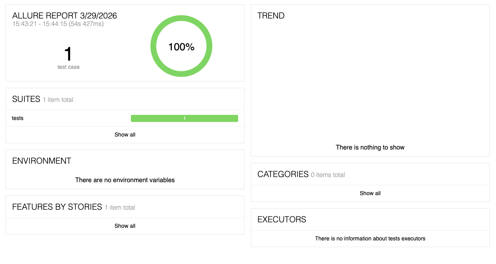

# SDET SimbirSoft - Тестовое задание

## Стек
- Python 3.14
- Selenium WebDriver
- PyTest
- Allure
- Page Object Model + Fluent Interface

## Запуск тестов

'''bash
pytest tests/test_form.py -v

## Allure отчёт
'''bash
pytest tests/test_form.py --alluredir=allure-results
allure serve allure-results

## Скриншот отчёта

---

## Тест-кейсы

### TC-001 — Позитивный: успешная отправка формы

| Поле | Значение |
|------|----------|
| **ID** | TC-001 |
| **Название** | Успешная отправка формы с корректными данными |
| **Предусловие** | Открыт браузер Chrome, загружена страница https://practice-automation.com/form-fields/ |
| **Шаги** | 1. Заполнить Name 2. Заполнить Password 3. Выбрать Milk и Coffee 4. Выбрать Yellow 5. Выбрать вариант в Do you like automation? 6. Заполнить Email в формате name@example.com 7. Заполнить Message 8. Нажать Submit |
| **Ожидаемый результат** | Появился алерт с текстом "Message received!" |
| **Статус** | ✅ Pass |

---

### TC-002 — Негативный: отправка формы с пустым полем Name

| Поле | Значение |
|------|----------|
| **ID** | TC-002 |
| **Название** | Отправка формы с незаполненным обязательным полем Name |
| **Предусловие** | Открыт браузер Chrome, загружена страница https://practice-automation.com/form-fields/ |
| **Шаги** | 1. Оставить поле Name пустым 2. Заполнить все остальные поля корректно 3. Нажать Submit |
| **Ожидаемый результат** | Алерт "Message received!" не появляется, форма не отправлена |
| **Статус** | 📋 Manual |
